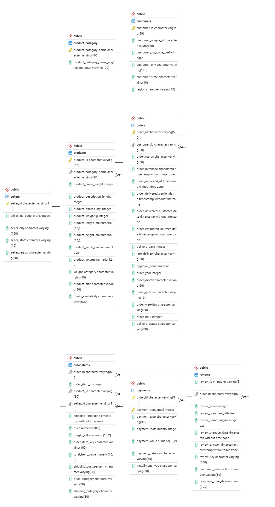
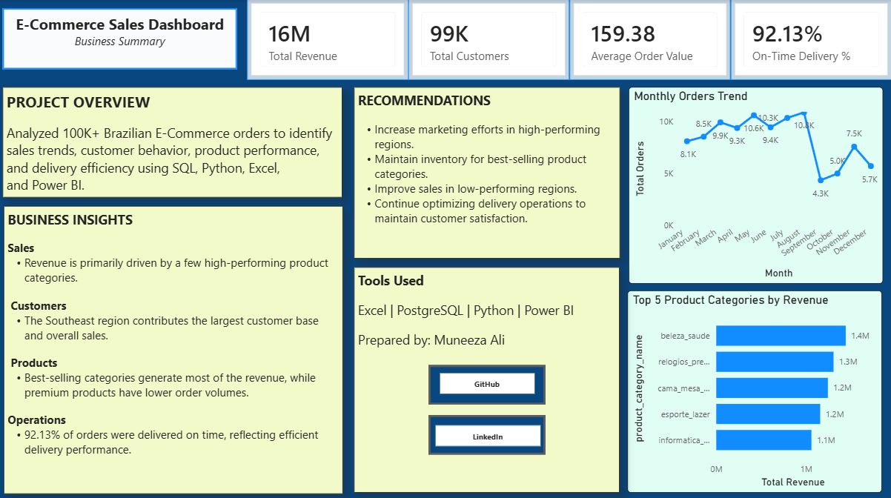

# 🛒 E-Commerce Sales Analytics

## 📌 Project Overview

This project presents an end-to-end analysis of a Brazilian E-Commerce dataset containing 100K+ orders.

The objective of this project is to analyze sales performance, customer behavior, product performance, payment patterns, and delivery efficiency to generate meaningful business insights and recommendations.

The complete analytics workflow includes data cleaning using Excel, exploratory data analysis using Python, business analysis using PostgreSQL, and interactive dashboard development using Power BI.

---

## 🛠️ Tools & Technologies

- **Excel** – Data Cleaning & Preprocessing
- **Python** – Exploratory Data Analysis
- **Pandas** – Data Manipulation
- **Matplotlib** – Data Visualization
- **PostgreSQL** – SQL Business Analysis
- **Power BI** – Interactive Dashboard Development
- **Power Query** – Data Transformation
- **DAX** – KPI & Measure Creation

---

## 🔄 Project Workflow

**Raw Data → Excel Data Cleaning → Cleaned Dataset → Python EDA → PostgreSQL Analysis → Power BI Dashboard → Business Insights & Recommendations**

---

## 📂 Repository Structure

```text
Ecommerce-Sales-Analytics/
│
├── 01_Dataset/
│   ├── Raw Data Files
│   └── README.md
│
├── 02_Excel/
│   └── Excel Data Cleaning & Preprocessing
│
├── 03_Python/
│   └── Python Exploratory Data Analysis
│
├── 04_SQL/
│   ├── 01_create_tables.sql
│   ├── 02_analysis_queries.sql
│   ├── 03_foreign_keys.sql
│   ├── 04_check_foreign_keys.sql
│   ├── 05_database_erd.pgerd
│   ├── 05_database_erd.png
│   └── README.md
│
├── 05_PowerBI/
│   ├── Executive Dashboard.png
│   ├── Sales Performance.png
│   ├── Product Analysis.png
│   ├── Customer Analysis.png
│   ├── Summary.png
│   └── README.md
│
└── README.md
```

---

# 📊 Dataset

The project uses multiple related E-Commerce tables:

- Customers
- Orders
- Order Items
- Payments
- Products
- Product Categories
- Reviews
- Sellers
- Geolocation
  
Large datasets are hosted externally due to GitHub file size limitations.

### 📁 Raw Data

Original dataset before cleaning and transformation.

[View E-Commerce Raw Data](https://docs.google.com/spreadsheets/d/16e8O5zdauKyEdq5e14ewpXDZRR3lYHaj/edit?usp=sharing&ouid=108936610654920574751&rtpof=true&sd=true)

### 🧹 Cleaned Data

The cleaned dataset was used for SQL analysis and Power BI dashboard development.

[View E-Commerce Clean Data](https://docs.google.com/spreadsheets/d/1TNzgZnrpwoWxeGk1lv0huPLmLOFJJ6U6/edit?usp=sharing&ouid=108936610654920574751&rtpof=true&sd=true)

### 📦 Final Dataset

A final dataset was generated during the Python analysis workflow.

[View Final E-Commerce Dataset](https://drive.google.com/file/d/1M_Tu9oDps2RapPSDrjKPIYBpdfkqAVvq/view?usp=sharing)

---

# 📗 Excel – Data Cleaning

Excel was used during the initial stage of the project to clean and prepare the dataset for analysis.

### Key Tasks

- Checked missing values
- Identified duplicate records
- Corrected data formats
- Reviewed inconsistent values
- Created analysis-ready columns
- Prepared cleaned tables for further analysis

The cleaned dataset was subsequently used for SQL analysis and Power BI dashboard development.

---

# 🐍 Python – Exploratory Data Analysis

Python was used to explore the E-Commerce dataset and understand important patterns in the data.

### Analysis Included

- Dataset structure and dimensions
- Missing value analysis
- Duplicate analysis
- Descriptive statistics
- Sales patterns
- Customer behavior
- Product performance
- Order trends
- Delivery performance
- Data visualization

Python libraries used include **Numpy**,**Pandas** and **Matplotlib**.

---

# 🗄️ PostgreSQL – SQL Analysis

PostgreSQL was used to perform detailed business analysis across the relational E-Commerce tables.

A total of **35 SQL business analysis queries** were created.

### Key Analysis Areas

- Total Orders
- Total Customers
- Total Sellers
- Total Products
- Total Revenue
- Average Order Value
- Orders by Status
- Top Customers by Spending
- Top Sellers
- Monthly Revenue Trend
- Top Selling Products
- Product Category Performance
- Revenue by Product Category
- Average Review Score
- Review Score Distribution
- Average Delivery Time
- Late Delivered Orders
- Customer Geographic Analysis
- Seller Geographic Analysis
- Payment Type Analysis
- Customer Distribution by Region
- Running Revenue
- Customer Spending Segmentation
- Orders Above Average Payment
- Freight Percentage
- Revenue by State
- Review Score by Payment Type

### SQL Concepts Used

- JOINs
- GROUP BY
- HAVING
- Subqueries
- CASE Statements
- Aggregate Functions
- RANK()
- DENSE_RANK()
- ROW_NUMBER()
- Window Functions
- Running Totals

---

# 🔗 Database Design & ERD

The relational database was created in PostgreSQL using multiple interconnected E-Commerce tables.

Foreign keys were created and validated to maintain relationships between the tables.

An Entity Relationship Diagram (ERD) was created to visualize the database structure.



---

# 📊 Power BI Dashboard

A **5-page interactive Power BI dashboard** was developed to present the final analysis.

### Dashboard Pages

1. Executive Dashboard
2. Sales Performance
3. Product Analysis
4. Customer Analysis
5. Business Summary

---

## 1️⃣ Executive Dashboard

Provides an overall view of major business KPIs, sales performance, order trends, and operational performance.


---

## 2️⃣ Sales Performance

Analyzes revenue and order performance across different business dimensions.


---

## 3️⃣ Product Analysis

Analyzes product categories based on revenue, order volume, average price, and freight cost.


---

## 4️⃣ Customer Analysis

Provides insights into customer distribution, regional performance, top customer locations, and monthly order trends.


---

## 5️⃣ Business Summary

Summarizes the major KPIs, business insights, and recommendations identified throughout the project.



---

# 📥 Download Power BI Dashboard

The Power BI `.pbix` file is hosted on Google Drive due to its large file size.

[Download Power BI Dashboard](https://drive.google.com/file/d/1OC-39ab8VTYiY_sXxxC8x1tpzMkCP6ud/view?usp=sharing)

---

# 🎯 Key Dashboard KPIs

- **Total Revenue:** 16M
- **Total Customers:** 99K
- **Average Order Value:** 159.38
- **On-Time Delivery:** 92.13%

The dashboard also analyzes orders, product categories, customer locations, ratings, freight costs, and monthly trends.

---

# 💡 Key Business Insights

### 💰 Sales

- Revenue is primarily driven by a few high-performing product categories.
- Monthly order volumes show noticeable fluctuations throughout the year.

### 👥 Customers

- The Southeast region contributes the largest customer base and overall sales.
- Customer activity is concentrated across major cities and states.

### 📦 Products

- Best-selling product categories generate a significant share of overall revenue.
- Premium/high-priced products tend to have lower order volumes.

### 🚚 Operations

- **92.13% of orders were delivered on time**, reflecting efficient overall delivery performance.

---

# 🚀 Business Recommendations

- Increase marketing efforts in high-performing regions.
- Maintain sufficient inventory for best-selling product categories.
- Develop strategies to improve sales in lower-performing regions.
- Monitor monthly demand patterns for better inventory planning.
- Continue optimizing delivery operations to maintain strong on-time delivery performance.
- Regularly monitor customer and product performance to identify growth opportunities.

---

# ⭐ Project Highlights

- Analyzed **100K+ E-Commerce orders**
- Worked with multiple relational datasets
- Performed data cleaning and preprocessing using Excel
- Conducted exploratory data analysis using Python
- Created **35 SQL business analysis queries**
- Applied advanced SQL window functions
- Created and validated database relationships
- Developed a database ERD
- Built a **5-page interactive Power BI dashboard**
- Generated business insights and actionable recommendations

---

# 👩‍💻 Author

**Muneeza**

[GitHub Profile](https://github.com/analyst-muneeza)

[LinkedIn Profile](https://www.linkedin.com/in/muneezaali-/)

---

⭐ If you found this project useful, feel free to explore the repository.
